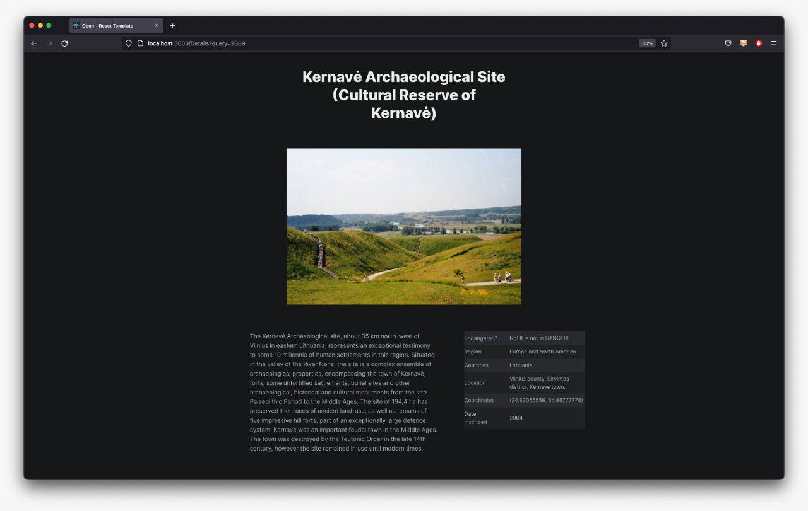
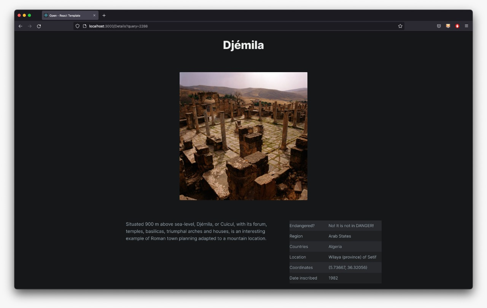
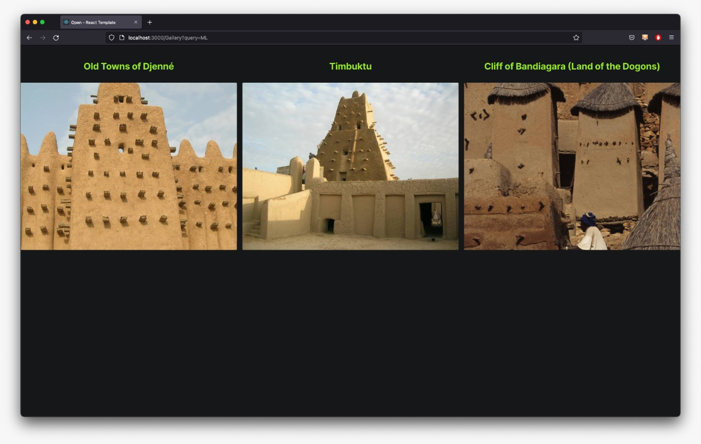
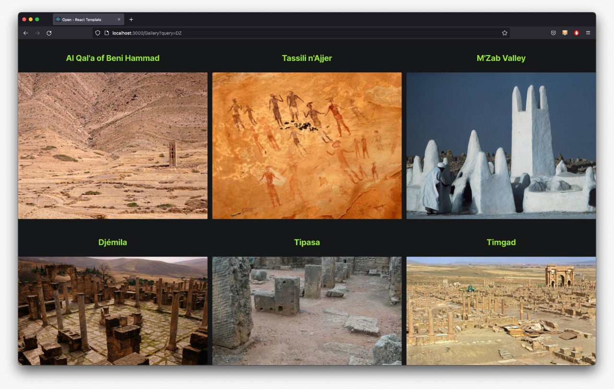
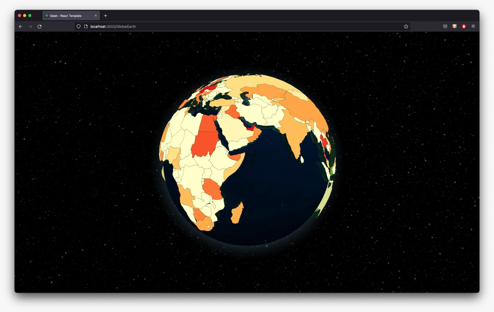
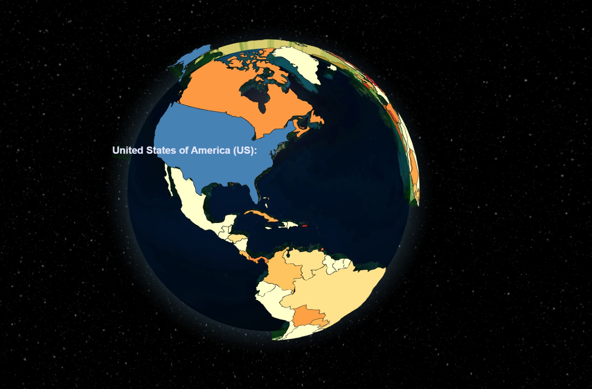

# To run the application :

   ```sh
   docker compose up -d --build
   ```

The application will be running at [localhost:3000](http://localhost:3000)

<br>
<br>

# Libraries and APIs used

- React-globe.gl (https://github.com/vasturiano/react-globe.gl)
- unesco-api (unesco-api.herokuapp.com/sites)
- Flask
- React

# Images of application







